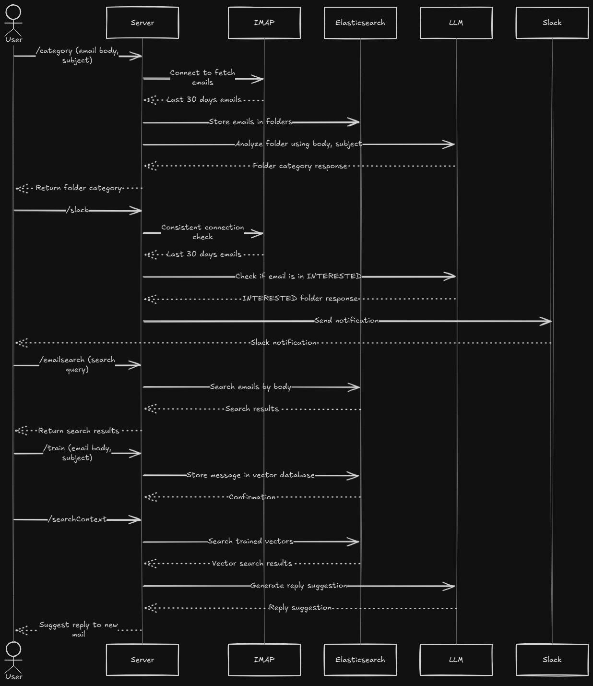

Architecture - 

When we start the server the emailwatcher will start listening to the inbox and will trigger the webhooks.

The webhooks will be triggered when the email recived is classified as "Interested".

There are 4 routes in the server.

1. /category
2. /search
3. /train
4. /searchContext

## /category

This route will be triggered when the email recived is classified as "Interested".

It will trigger the webhook and return the category of the email.

## /search

This route will be triggered when the user wants to search for emails.

It will search the emails in the elasticsearch index and return the results.

## /train

This route will be triggered when the user wants to train the model.

It will train the model and return the id of the document.

## /searchContext

This route will be triggered when the user wants to search for context.

It will search the context in the elasticsearch index and return the results.